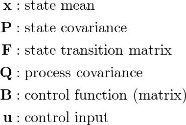
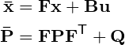
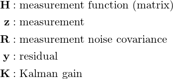
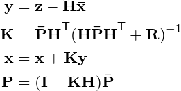
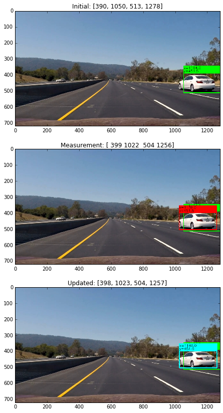
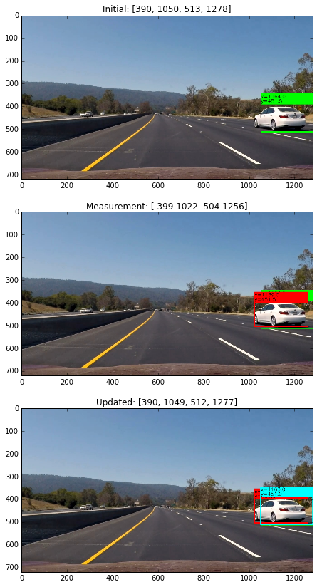
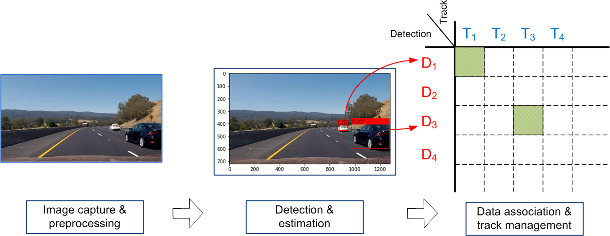
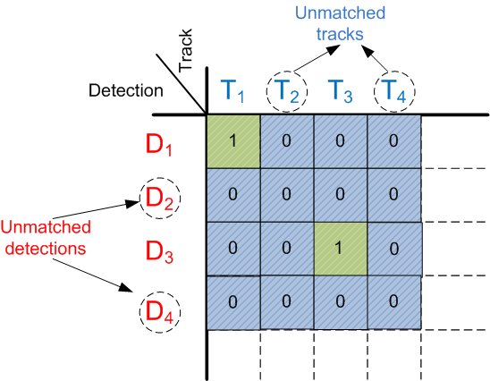
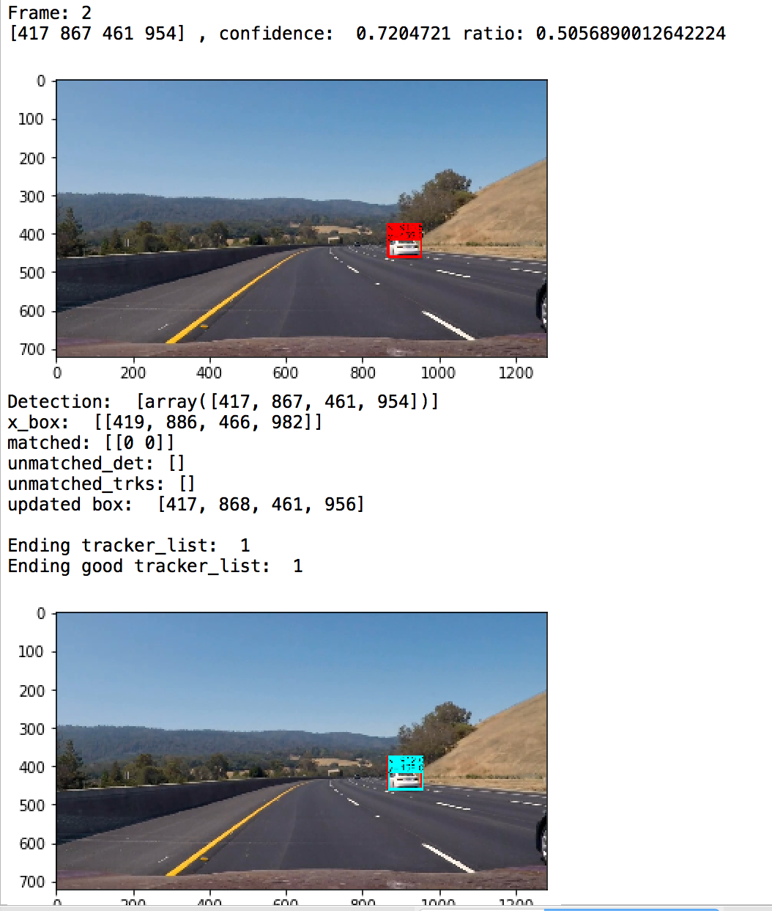

# Vehicle Detection and Tracking


## Overview
This repo illustrates the detection and tracking of multiple vehicles using a camera mounted inside a self-driving car.  The aim here is to provide developers, researchers, and engineers a simple framework to quickly iterate different detectors and tracking algorithms. In the process, I focus on simplicity and readability of the code. The detection and tracking pipeline is relatively staight forward. It first initializes a detector and a tracker. Next, detector localizes the vehicles in each video frame. The tracker is then updated with the detection results. Finally the tracking results are annotated and displayed in a video frame.

## Key files in this repo
  
  
  * detector.py -- implements  ```CarDetector``` class to output car detection results
  * tracker.py  -- implements Kalman Filter-based prediction and update for tracking
  * main.py -- implements the detection and tracking pipeline, including detection-track assignment and track management
  * helpers.py -- helper functions
  * ssd_mobilenet_v1_coco_11_06_2017/frozen_inference_graph.pb -- pre-trained mobilenet-coco model

## Detection
In the pipeline, vehicle (car) detection takes a captured image as input and produces the bounding boxes as the output. We use TensorFlow Object Detection API, which is an open source framework built on top of TensorFlow to construct, train and deploy object detection models. The Object Detection API also comes with a collection of detection models pre-trained on the COCO dataset that are well suited for fast prototyping. Specifically, we use a lightweight model: ssd\_mobilenet\_v1\_coco that is based on Single Shot Multibox Detection (SSD) framework with minimal modification. Though this is a general-purpose detection model (not specifically optimized for vehicle detection), we find this model achieves the balance between bounding box accuracy and inference time.

The detector is implemented in ```CarDetector``` class in detector.py. The output are the coordinates of the bounding boxes (in the format of [y\_up, x\_left, y\_down, x\_right] ) of all the detected vehicles.

The COCO dataset contains images of 90 classes, with the first 14 classes all related to transportation, including bicycle, car, and bus, etc. The ID for car is 3.

```
category_index={1: {'id': 1, 'name': u'person'},
                        2: {'id': 2, 'name': u'bicycle'},
                        3: {'id': 3, 'name': u'car'},
                        4: {'id': 4, 'name': u'motorcycle'},
                        5: {'id': 5, 'name': u'airplane'},
                        6: {'id': 6, 'name': u'bus'},
                        7: {'id': 7, 'name': u'train'},
                        8: {'id': 8, 'name': u'truck'},
                        9: {'id': 9, 'name': u'boat'},
                        10: {'id': 10, 'name': u'traffic light'},
                        11: {'id': 11, 'name': u'fire hydrant'},
                        13: {'id': 13, 'name': u'stop sign'},
                        14: {'id': 14, 'name': u'parking meter'}} 
```
The following code snippet implements the actual detection using TensorFlow API.

```
(boxes, scores, classes, num_detections) = self.sess.run(
                  [self.boxes, self.scores, self.classes, self.num_detections],
                  feed_dict={self.image_tensor: image_expanded})
```    
Here ```boxes```, ```scores```, and ```classes``` represent the bounding box, confidence level, and class name corresponding to each of the detection, respectively. Next, we select the detections that are cars and have a confidence greater than a threshold ( e.g., 0.3 in this case). 
```
idx_vec = [i for i, v in enumerate(cls) if ((v==3) and (scores[i]>0.3))]
```
To detect all kinds of vehicles, we also include the indices for bus and truck.
```
idx_vec = [i for i, v in enumerate(cls) if (((v==3) or (v==6) or (v==8)) and (scores[i]>0.3))]
```
To further reduce possible false positives, we include thresholds for bounding box width, height, and height-to-width ratio.

```
if ((ratio < 0.8) and (box_h>20) and (box_w>20)):
    tmp_car_boxes.append(box)
    print(box, ', confidence: ', scores[idx], 'ratio:', ratio)
else:
     print('wrong ratio or wrong size, ', box, ', confidence: ', scores[idx], 'ratio:', ratio)
```

## Kalman Filter for Bounding Box Measurement

We use Kalman filter for tracking objects. Kalman filter has the following important features that tracking can benefit from:

* Prediction of object's future location
* Correction of the prediction based on new measurements
* Reduction of noise introduced by inaccurate detections
* Facilitating the process of association of multiple objects to their tracks

Kalman filter consists of two steps: prediction and update. The first step uses previous states to predict the current state. The second step uses the current measurement, such as detection bounding box location , to correct the state. The formula are provided in the following:

### Kalman Filter Equations:
#### Prediction phase: notations

#### Prediction phase: equations

#### Update phase: notations

#### Update phase: equations


### Kalman Filter Implementation
In this section, we describe the implementation of the Kalman filter in detail.

The state vector has eight elements as follows:
```
[up, up_dot, left, left_dot, down, down_dot, right, right_dot]
```
That is,  we use the coordinates and their first-order derivatives of the up left corner and lower right corner of the bounding box.

The process matrix, assuming the constant velocity (thus no acceleration), is:

```
self.F = np.array([[1, self.dt, 0,  0,  0,  0,  0, 0],
                    [0, 1,  0,  0,  0,  0,  0, 0],
                    [0, 0,  1,  self.dt, 0,  0,  0, 0],
                    [0, 0,  0,  1,  0,  0,  0, 0],
                    [0, 0,  0,  0,  1,  self.dt, 0, 0],
                    [0, 0,  0,  0,  0,  1,  0, 0],
                    [0, 0,  0,  0,  0,  0,  1, self.dt],
                    [0, 0,  0,  0,  0,  0,  0,  1]])
```
The measurement matrix, given that the detector only outputs the coordindate (not velocity), is:

```
self.H = np.array([[1, 0, 0, 0, 0, 0, 0, 0],
                   [0, 0, 1, 0, 0, 0, 0, 0],
                   [0, 0, 0, 0, 1, 0, 0, 0], 
                   [0, 0, 0, 0, 0, 0, 1, 0]])
```
The state, process, and measurement noises are :

```
 # Initialize the state covariance
 self.L = 100.0
 self.P = np.diag(self.L*np.ones(8))
        
        
 # Initialize the process covariance
 self.Q_comp_mat = np.array([[self.dt**4/2., self.dt**3/2.],
                                    [self.dt**3/2., self.dt**2]])
 self.Q = block_diag(self.Q_comp_mat, self.Q_comp_mat, 
                            self.Q_comp_mat, self.Q_comp_mat)
        
# Initialize the measurement covariance
self.R_scaler = 1.0/16.0
self.R_diag_array = self.R_ratio * np.array([self.L, self.L, self.L, self.L])
self.R = np.diag(self.R_diag_array)
```
Here  ```self.R_scaler``` represents the "magnitude" of measurement noise relative to state noise. A low ```self.R_scaler``` indicates a more reliable measurement. The following figures visualize the impact of measurement noise to the Kalman filter process. The green bounding box represents the prediction (initial) state. The red bounding box represents the measurement.
If measurement noise is low, the updated state (aqua colored bounding box) is very close to the measurement (aqua bounding box completely overlaps over the red bounding box).



In contrast, if measurement noise is high, the updated state is very close to the initial prediction (aqua bounding box completely overlaps over the green bounding box).



## Detection-to-Tracker Assignment

The module ```assign_detections_to_trackers(trackers, detections, iou_thrd = 0.3)``` takes from current list of trackers and new detections, output matched detections, unmatched trackers, unmatched detections.



### Linear Assignment and Hungarian (Munkres) algorithm

If there are multiple detections, we need to match (assign) each of them to a tracker. We use intersection over union (IOU) of a tracker bounding box and detection bounding box as a metric. We solve the maximizing the sum of IOU assignment problem using the Hungarian algorithm (also known as Munkres algorithm). The machine learning package scikit-learn has a build-in utility function that implements the Hungarian algorithm.

```
matched_idx = linear_assignment(-IOU_mat)   
```
Note that ```linear_assignment ``` by default minimizes an objective function. So we need to reverse the sign of ```IOU_mat``` for maximization.

### Unmatched detections and trackers

Based on the linear assignment results, we keep two lists for unmatched detections and unmatched trackers, respectively. When a car enters into a frame and is first detected, it is not matched with any existing tracks, thus this particular detection is referred to as an unmatched detection, as shown in the following figure. In addition, any matching with an overlap less than ```iou_thrd``` signifies the existence of 
an untracked object. When a car leaves the frame, the previously established track has no more detection to associate with. In this scenario, the track is referred to as unmatched track. Thus, the tracker and the detection associated in the matching are added to the lists of unmatched trackers and unmatched detection, respectively.



## Pipeline

We include two important design parameters, ```min_hits``` and ```max_age```, in the pipeline.  The parameter ```min_hits``` is the number of consecutive matches needed to establish a track. The parameter ```max_age``` is number of consecutive unmatched detections before a track is deleted. Both parameters need to be tuned to improve the tracking and detection performance.

The pipeline deals with matched detection, unmatched detection, and unmatched trackers sequentially. We annotate the tracks that meet the ```min_hits``` and ```max_age``` condition. Proper book keeping is also needed to delete the stale tracks. 

The following examples show the process of the pipeline. When the car is first detected in the first video frame, running the following line of code returns an empty list, an one-element list, and an empty list  for ```matched```, ```unmatched_dets```, and ```unmatched_trks```, respectively. 

```
matched, unmatched_dets, unmatched_trks \
    = assign_detections_to_trackers(x_box, z_box, iou_thrd = 0.3) 
```
We thus have a situation of unmatched detections. Unmatched detections are processed by the following code block:

```
if len(unmatched_dets)>0:
        for idx in unmatched_dets:
            z = z_box[idx]
            z = np.expand_dims(z, axis=0).T
            tmp_trk = Tracker() # Create a new tracker
            x = np.array([[z[0], 0, z[1], 0, z[2], 0, z[3], 0]]).T
            tmp_trk.x_state = x
            tmp_trk.predict_only()
            xx = tmp_trk.x_state
            xx = xx.T[0].tolist()
            xx =[xx[0], xx[2], xx[4], xx[6]]
            tmp_trk.box = xx
            tmp_trk.id = track_id_list.popleft() # assign an ID for the tracker
            tracker_list.append(tmp_trk)
            x_box.append(xx)
```
This code block carries out two important tasks, 1) creating a new tracker ```tmp_trk``` for the detection; 2) carrying out the Kalman filter's predict stage ```tmp_trk.predict_only()```. Note that this newly created track is still in probation period, i.e., ```trk.hits =0```, so this track is yet established at the end of pipeline. The output image is the same as the input image - the detection bounding box is not annotated.


When the car is  detected again in the second video frame, running the following ```assign_detections_to_trackers``` returns an one-element list , an empty list, and an empty list for matched, unmatched_dets, and unmatched_trks, respectively. As shown in the following figure, we have a matched detection, which will be processed by the following code block:

```
if matched.size >0:
        for trk_idx, det_idx in matched:
            z = z_box[det_idx]
            z = np.expand_dims(z, axis=0).T
            tmp_trk= tracker_list[trk_idx]
            tmp_trk.kalman_filter(z)
            xx = tmp_trk.x_state.T[0].tolist()
            xx =[xx[0], xx[2], xx[4], xx[6]]
            x_box[trk_idx] = xx
            tmp_trk.box =xx
            tmp_trk.hits += 1
```
This code block carries out two important tasks, 1) carrying out the Kalman filter's prediction and update stages ```tmp_trk.kalman_filter()```; 2) increasing the hits of the track by one ```tmp_trk.hits +=1```. With this update,  
the condition ```if ((trk.hits >= min_hits) and (trk.no_losses <=max_age)) ``` is statified, so the track is fully established. As the result, the bounding box is annotated in the output image, as shown in the figure below.

## Issues

The main issue is occlusion. For example, when one car is passing another car, the two cars can be very close to each other. This can fool the detector into outputing a single (and possibly bigger bounding) box, instead of two separate bounding boxes. In addition, the tracking algorithm may treat this detection as a new detection and sets up a new track.  The tracking algorithm may fail again when one of the passing car moves away from another car. 


